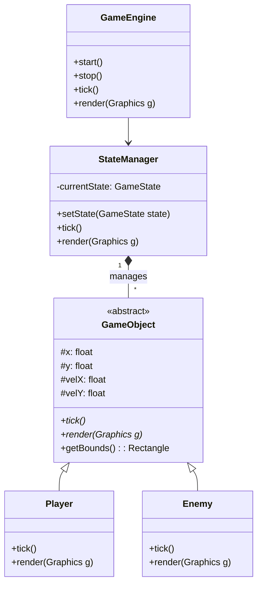

<div align="center">
  
# ⚔️ ArcaneSpire 
### Java OOP Game Engine & Framework

[](https://java.com)
[](https://github.com/Beraty14/ArcaneSpire)
[](https://github.com/Beraty14/ArcaneSpire)

*A robust, purely Object-Oriented game development framework written in Java. Engineered for high-performance rendering, structured entity management, and modular game states.*

</div>

---

## ⚡ Overview
**ArcaneSpire** is a custom-built 2D game framework designed to abstract the complexities of game loop management, physics, and rendering. By utilizing rigorous Object-Oriented Programming (OOP) principles, ArcaneSpire provides an elegant API for developers to instantiate entities, manage scenes, and handle complex game logic without getting bogged down by low-level graphics implementations.

## 🚀 Core Features
- **Deterministic Game Loop**: A highly optimized tick/render cycle ensuring consistent physics calculations across different hardware.
- **Entity-Component-like Structure**: Pure OOP implementation of game objects (`Player`, `Enemies`, `Projectiles`) with deep inheritance and polymorphism.
- **State Management**: Seamlessly switch between Main Menu, In-Game, Pause, and Game Over states using the `StateManager` architecture.
- **Custom Rendering Pipeline**: Hardware-accelerated 2D graphics rendering via Java AWT/Swing or JavaFX integration.
- **Event & Collision Systems**: Efficient AABB (Axis-Aligned Bounding Box) collision detection and custom event listeners.

## 🏗️ Engine Architecture



## ⚙️ Setup & Compilation

1. **Clone the Framework**
   ```bash
   git clone https://github.com/Beraty14/ArcaneSpire.git
   cd ArcaneSpire
   ```

2. **Build with Maven/Gradle (or compile directly)**
   ```bash
   javac -d bin src/com/arcanespire/main/*.java
   ```

3. **Launch the Engine**
   ```bash
   java -cp bin com.arcanespire.main.Game
   ```

## 🎮 Usage Example
To create a custom entity in your game:
```java
public class Wizard extends GameObject {
    public Wizard(float x, float y, ID id) {
        super(x, y, id);
    }

    @Override
    public void tick() {
        x += velX;
        y += velY;
    }

    @Override
    public void render(Graphics g) {
        g.setColor(Color.CYAN);
        g.fillRect((int)x, (int)y, 32, 32);
    }
}
```

## 🛡️ License
Distributed under the MIT License. Developed by [Berat Yurtsever](https://github.com/Beraty14).
